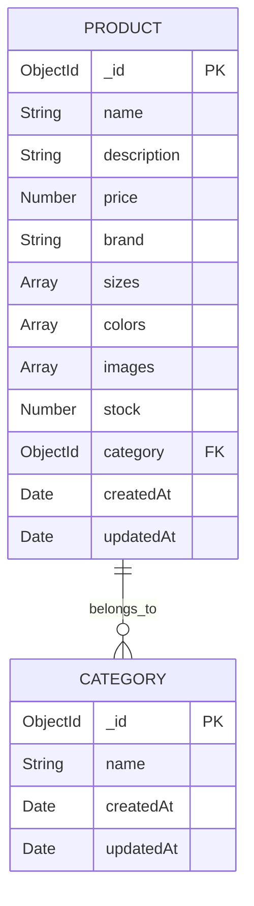

# Fashion E-commerce Application

Une application e-commerce moderne de vente de vêtements, développée avec React et Node.js.

## 🚀 Fonctionnalités

- Catalogue de produits avec images multiples
- Catégorisation (Homme, Femme, Enfant)
- Gestion des stocks
- Interface utilisateur moderne et responsive
- Ajout de nouveaux produits
- Filtrage par catégories

## 🛠️ Technologies Utilisées

- **Frontend**: React, Material-UI, Redux
- **Backend**: Node.js, Express
- **Base de données**: MongoDB
- **API**: RESTful

## 📋 Prérequis

- Node.js (version 14 ou supérieure)
- npm (généralement installé avec Node.js)
- MongoDB (installé localement ou Atlas)

## 🔧 Installation

1. Clonez le repository :
```bash
git clone [URL_DU_REPO]
cd project_a_2
```

2. Installez les dépendances :
```bash
cd client
npm install
```

3. Configurez les variables d'environnement :
Créez un fichier `.env` dans le dossier client avec les variables suivantes :
```
REACT_APP_API_URL=http://localhost:5000
```

## 🚀 Lancement de l'application

1. Démarrez le serveur de développement :
```bash
cd client
npm start
```

L'application sera accessible à l'adresse : http://localhost:3000

## 📁 Structure du Projet

```
project_a_2/
├── client/
│   ├── public/
│   ├── src/
│   │   ├── components/
│   │   ├── pages/
│   │   ├── store/
│   │   └── App.js
│   ├── package.json
│   └── README.md
└── README.md
```

## 💾 Base de Données

### Structure MongoDB



## 🔍 Fonctionnalités Détaillées

### Gestion des Produits
- Ajout de nouveaux produits avec images multiples
- Gestion des stocks en temps réel
- Catégorisation des produits
- Système de prix et descriptions détaillées

### Interface Utilisateur
- Design minimaliste inspiré d'Apple
- Navigation intuitive
- Affichage responsive des produits
- Animations fluides

## 🛠️ Développement

### Commandes Disponibles

- `npm start` : Lance le serveur de développement
- `npm build` : Crée une version de production
- `npm test` : Lance les tests
- `npm run lint` : Vérifie le code avec ESLint

## 📝 Notes

- Assurez-vous que MongoDB est en cours d'exécution
- Le port par défaut est 3000 pour le frontend
- Les images sont stockées via des URLs externes (Unsplash)

## 🤝 Contribution

1. Fork le projet
2. Créez votre branche de fonctionnalité (`git checkout -b feature/AmazingFeature`)
3. Committez vos changements (`git commit -m 'Add some AmazingFeature'`)
4. Push vers la branche (`git push origin feature/AmazingFeature`)
5. Ouvrez une Pull Request

## 📄 Licence

Ce projet est sous licence MIT. Voir le fichier `LICENSE` pour plus de détails.

## 👥 Auteurs

- BALIK / BONK

## 🙏 Remerciements

- Material-UI pour les composants
- Unsplash pour les images
- MongoDB pour la base de données 